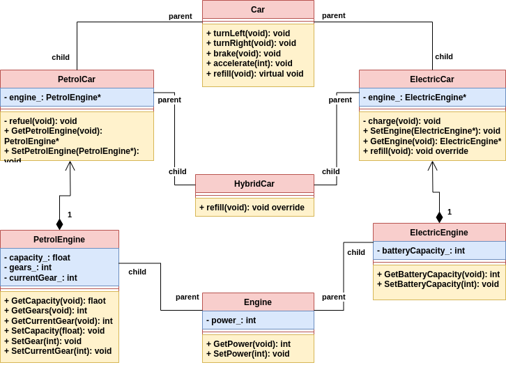

# Task description

## Object-oriented C++

UWAGA: Praca domowa jest na gałęzi [diamond](https://github.com/coders-school/Cars/tree/diamond). Kod tam to mój kod po lekcjach wideo i jest on inny niż ten na gałęzi main.

### Zadanie #1

1. <!-- .element: class="fragment fade-in" --> Zaproponuj właściwą abstrakcję (interfejs)
2. <!-- .element: class="fragment fade-in" --> Zastosuj dziedziczenie
3. <!-- .element: class="fragment fade-in" --> Napraw enkapsulację
4. <!-- .element: class="fragment fade-in" --> Użyj polimorfizmu, aby za pomocą wskaźnika na klasę bazową reprezentować dowolny typ samochodu

### Pytania

1. <!-- .element: class="fragment fade-in" --> Jak trzymać silniki? Przez wartość, referencję, czy wskaźnik?
2. <!-- .element: class="fragment fade-in" --> Czy jest problem diamentowy?
3. <!-- .element: class="fragment fade-in" --> Czy są wycieki pamięci?
4. <!-- .element: class="fragment fade-in" --> Czy kod jest testowalny?

# Solution #1

# Zadanie #2
1. (5 XP) Utwórz wyjątek <code>InvalidGear</code>. Ma on być rzucany wtedy, gdy ktoś próbuje w niewłaściwy sposób zmienić bieg, np. z 5 na R. Ma on dziedziczyć po `std::logic_error`.
2. (10 XP) Napisz testy jednostkowe do tego kodu. W szczególności przetestuj rzucanie powyższego wyjątku. Skonfiguruj odpowiednio CMake'a.
3. (0 XP) Napraw interfejs, aby był łatwy w poprawnym użyciu i trudny do niewłaściwego użycia (np. <code>accelerate(-999)</code>). Bez punktów, bo ciężko zautomatyzować tak ogólne zadanie i każdy wymyśli tutaj coś innego.
4. Przeczytaj artykuł [SOLID czyli dobre praktyki w programowaniu obiektowym](https://www.samouczekprogramisty.pl/solid-czyli-dobre-praktyki-w-programowaniu-obiektowym/)